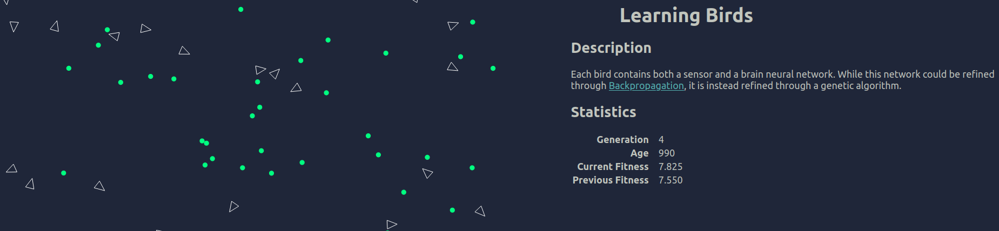

# Learning Birds

## Description
A simple genetic algorithm woven together with a neural network based upon a [tutorial](https://pwy.io/en/posts/learning-to-fly-pt1/) by [Patryk27](https://github.com/Patryk27/shorelark). Some major changes were made, including changing the backend neural network implementation to matrix designs and rebuilding the frontend in SolidJS.

## Dependencies
- [Rust](https://www.rust-lang.org/) for building & testing rust
  - Use Rust nightly for planned dependency on [wasm-bindgen-rayon](https://github.com/GoogleChromeLabs/wasm-bindgen-rayon). Although this ought to be set by the `rust-toolchain.toml` file.
- [Cargo Trunk](https://trunkrs.dev/) to serve the yew site on the front-end.

## Usage
Once `Trunk` is installed, call `trunk serve` from the command line and check out [localhost:8080/].

## TODO:
- [ ] Add RustDocs
- [ ] Integrate Rayon throw wasm-bindgen-rayon
- [ ] Add more tests to Rust code
- [x] Handle resize event
- [ ] Refactor observers on the front-end to own their elements
- [x] Swap to Yew for testing
- [ ] [Stylist](https://crates.io/crates/stylist) for CSS